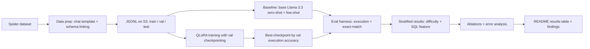

# Fine-Tuning Llama 3.3 with QLoRA for Text-to-SQL

A resume-grade, end-to-end project: fine-tune **Llama 3.3** on the **Spider**
text-to-SQL benchmark using **QLoRA**, with a rigorous, fully automatic
**evaluation harness** that *proves* the fine-tuning actually helped.

> **Status:** data-prep stage built — Spider staging script (HF examples + schema,
> chat-template formatting, train/val/test split, optional S3 mirror + schema
> linking) validated on real data. Training and eval harness are next.
> in place. Baseline numbers (X%) and fine-tuned results (Y%) are filled in as
> the pipeline runs.

---

## The claim we are building

> Fine-tuned Llama 3.3 with QLoRA on the Spider text-to-SQL benchmark,
> improving execution accuracy from **X%** (zero-shot baseline) to **Y%**
> (fine-tuned), using a held-out evaluation harness with execution-based
> scoring and validation-driven checkpoint selection.

Every number in that sentence must come from the harness below — a baseline
without fine-tuning is meaningless, and an aggregate without stratification
hides where the model actually struggles.

## Pipeline



## Documentation

- **`docs/development-log.md`** — what happened, step by step
- **`docs/decisions.md`** — why every choice was made (D1–D7)
- **`docs/RUNBOOK.md`** — exact commands from checkout to results

## Repo structure

```
llama33-text2sql/
├── README.md            ← this file: pipeline diagram, results table, findings
├── pyproject.toml       ← uv project (torch, transformers, peft, bitsandbytes, ...)
├── data_prep/           ← Spider → S3 formatting scripts (chat template, schema linking)
├── training/            ← QLoRA training script + configs (r, alpha, lr, epochs)
├── eval/                ← execution-accuracy harness (SQLite exec + exact-match)
└── analysis/            ← ablations, error-analysis notebooks
```

## 1. Scope the problem

- **Dataset:** [Spider](https://yale-lily.github.io/spider) — ~10k
  question/SQL pairs across ~200 databases; the standard academic text-to-SQL
  benchmark (comparable to published numbers — a strong interview talking point).
- **Explicit scope decisions** (write these down before touching code):
  - **Cross-database generalization** (model sees schema at inference time) vs.
    single-database specialization — *decided:* cross-database.
  - **SQL features in scope:** SELECT/WHERE, JOINs, aggregations
    (GROUP BY/HAVING), nested subqueries, set operations (UNION/INTERSECT).
  - **Difficulty:** start with the full distribution (Spider ships easy/medium/
    hard/extra-hard labels) and stratify every result by it.

**Deliverable:** a one-paragraph scope doc in `data_prep/SCOPE.md` stating
exactly what's in and out.

## 2. Stage data in S3 and format for Llama 3.3

- Convert each Spider example to Llama 3.3's chat template:
  - **System:** task description + relevant table schema (DDL or compact form)
  - **User:** the natural-language question
  - **Assistant:** the gold SQL query
- Split **train / val / test** (80/10/10). Keep Spider's original dev set fully
  held out as the test set — never tune on it.
- Upload as JSONL, partitioned by split:

  ```
  s3://your-bucket/text2sql/train.jsonl
  s3://your-bucket/text2sql/val.jsonl
  s3://your-bucket/text2sql/test.jsonl
  ```

- Loader: `datasets.load_dataset` (custom loading script) or `boto3` +
  `datasets.Dataset.from_json` straight from S3.
- This step is also the data-engineering showcase: **schema linking**
  (matching question tokens to table/column names), prompt templating, clean
  S3 organization.

## 3. Baseline before touching training

- Run the **base, non-fine-tuned** Llama 3.3 on the test set:
  - Zero-shot (schema + question only)
  - Few-shot (2–3 in-context examples) as a stronger baseline
- Record **execution accuracy** for both. The claim is the *delta* — it's
  meaningless without X.

## 4. QLoRA training

- **Stack:** Hugging Face `transformers` + `peft` + `bitsandbytes` (4-bit NF4
  quantization of the frozen base model).
- **Target modules:** attention projections `q_proj`, `k_proj`, `v_proj`,
  `o_proj` (optionally the MLP `gate/up/down_proj` for more capacity).
- **Starting hyperparameters:**

  | Parameter | Starting value |
  |---|---|
  | LoRA rank (r) | 16–32 |
  | LoRA alpha | 2 × rank |
  | Learning rate | 1e-4 to 2e-4 |
  | Epochs | 2–3 (watch val loss) |
  | Quantization | 4-bit NF4 |

- **Compute:** one cloud GPU (24 GB+) is enough at this scale — Databricks GPU
  cluster or SageMaker.

## 5. Train with validation-driven checkpointing

- Evaluate on the validation set every N steps.
- Keep the checkpoint with the **best validation execution accuracy**, not the
  last step.
- Log everything (train/val loss, val exec accuracy, hyperparameters) per run —
  MLflow pairs naturally with a Databricks setup; a CSV tracker also works.
- Watch for: **overfitting** (val loss rising) and **catastrophic forgetting**
  (spot-check a few general, non-SQL prompts).

## 6. Execution-accuracy eval harness (the core deliverable)

For each test example:

1. Generate SQL from the model (question + schema).
2. Execute **both** the generated and gold SQL against a real SQLite (or
   Postgres) instance of that example's database.
3. Compare result sets (row order insensitive) → **execution accuracy**.
4. Also compute **exact-match** (normalized SQL string) as a stricter secondary
   metric.
5. **Stratify** by Spider difficulty (easy/medium/hard/extra-hard) and by SQL
   feature (joins, aggregations, subqueries) — this is how you say *where*
   fine-tuning helped, not just *that* it did.
6. Report the fine-tuned score **alongside the baseline in every table**.

## 7. Ablations and error analysis

- Compare at least two configs (e.g. LoRA rank 16 vs. 32, or 2 vs. 3 epochs)
  and report the delta.
- Manually bucket ~30–50 failed generations: wrong table/column, incorrect
  join, syntax error, dialect quirk, right-logic-wrong-shape.

## 8. Package for the resume

- Repo structure as above; README carries the pipeline diagram, results table,
  ablations, and error categories.
- The eval harness runs automatically and end to end — no LLM-as-judge, fully
  reproducible numbers.

## Evaluation design principles

- **Split discipline:** train updates weights, val picks checkpoints, test is
  touched exactly once at the end.
- **Automatic metrics over LLM-as-judge:** execution accuracy and exact-match
  need no judge and are fully reproducible.
- **Always report a baseline** — the claim is the delta.
- **Stratify, don't just aggregate.**

## Setup (uv)

```sh
cd ~/llama33-text2sql
uv sync            # installs torch, transformers, peft, bitsandbytes, ...
uv run python -c "import torch, transformers, peft; print('stack OK')"
```

(Heavy installs — `torch` is several GB; `uv sync` once, then iterate.)

## Next steps (checklist)

- [x] `data_prep/SCOPE.md` — the one-paragraph scope decision
- [x] Spider → S3 staging script + loader (validated on real data)
- [x] SQLite databases fetched (206MB, official zip) + eval harness built
      (`eval/run_eval.py`: execution + exact-match, stratified, gold-mode
      validated at 100%, negative-tested on wrong SQL)
- [ ] Spider → S3 staging script + loader
- [ ] Baseline run (zero-shot + few-shot) → X%
- [ ] QLoRA training with val checkpointing
- [ ] Eval harness (execution + exact-match, stratified)
- [ ] Ablations + error analysis
- [ ] Results table in this README (baseline vs. fine-tuned, by difficulty)

No credentials in the repo; S3 access via your environment/role.
