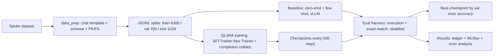

# Fine-Tuning Llama 3.1 8B with QLoRA for Text-to-SQL

An end-to-end, resume-grade project: fine-tune **Llama 3.1 8B** on the
**Spider** text-to-SQL benchmark using **QLoRA**, with a rigorous, fully
automatic **evaluation harness** that proves the fine-tuning helped.

> **Status: COMPLETE — the claim is measured and reproducible.**

---

## 🏆 The claim

> **Fine-tuned Llama 3.1 8B with QLoRA: execution accuracy improved from
> 67.89% (zero-shot baseline) to 73.89% (fine-tuned) on the identical
> 1,034-example test set (+6.0 points)** — measured by an automatic
> execution-based harness (no LLM-as-judge).

Every number below comes from the same automatic harness, on the same held-out
test set, and is recorded in the experiment ledger (`runs/`) and MLflow.

## Results

### Headline (full test set, n=1,034)

| Model | Execution accuracy | Exact match |
|---|---|---|
| Llama 3.1 8B zero-shot (baseline) | **67.89%** | 32.5% |
| **+ QLoRA fine-tuning** (r=16, 2 epochs) | **73.89%** | — |

### Per-feature execution accuracy (fine-tuned vs zero-shot)

| Feature | Zero-shot | Fine-tuned | Δ |
|---|---|---|---|
| Aggregation | 69.4% | 74.8% | **+5.4** |
| Join | 59.1% | 62.3% | **+3.2** |
| Subquery | 43.4% | 55.4% | **+12.0** |
| Set-operation | 43.8% | 56.3% | **+12.5** |

*(Computed from the per-row results on the full 1,034 test set; rows can carry
multiple feature labels.)*

### Error analysis (fine-tuned, 270/1,034 failures = 26.1%)

| Bucket (first-pass) | Share of failures |
|---|---|
| Executed but wrong result | 83% |
| Syntax / execution error | 16% |
| Gold-query error | ~1% |

Failures are dominated by **joins** and **aggregations** — consistent with the
feature table. A 50-example dump for the manual bucketing pass is generated by
`analysis/error_analysis.py` → `analysis/failures.md`.

## Pipeline



## Repo structure

```
llama33-text2sql/
├── README.md                ← this file
├── modal_app.py             ← Modal entrypoints (baseline / train / eval)
├── data_prep/               ← Spider staging (SCOPE.md, stage_spider.py, loader.py)
├── training/                ← run_baseline.py, train_qlora.py
├── eval/                    ← run_eval.py — the execution-accuracy harness
├── analysis/                ← error_analysis.py + failures.md
├── runs/                    ← experiment ledger (RUNS.md + JSON records + backfill)
├── data/                    ← staged splits + Spider databases (gitignored)
└── docs/
    ├── DEVELOPMENT-LOG.md   ← every step, in order
    ├── DECISIONS.md         ← D1–D9, why each choice was made
    ├── PROBLEMS.md          ← P1–P13: every failure, root cause, fix
    ├── RESULTS.md           ← the full results story + caveats
    ├── RUNBOOK.md           ← commands from checkout to results
    └── PORTFOLIO.md         ← resume bullets + interview Q&A
```

## Quickstart

### Setup

```sh
cd ~/llama33-text2sql
uv sync
modal token new
modal secret create huggingface-secret HF_TOKEN="hf_..."
```

### Data

```sh
uv run python data_prep/stage_spider.py --out data/processed
# -> train/val/test JSONL (6300/700/1034); databases fetched by the script
```

### Validate the harness (no GPU)

```sh
uv run python eval/run_eval.py --test-jsonl data/processed/test.jsonl \
    --db-dir data/spider/spider_data/database --gold-mode --max-examples 60
# 100% expected — proves the plumbing
```

### Baselines

```sh
modal run modal_app.py::run_baseline --model meta-llama/Llama-3.1-8B-Instruct
# full test set zero-shot -> 67.89%   (few-shot: --few-shot 2)
```

### Train

```sh
modal run modal_app.py::run_train \
    --model meta-llama/Llama-3.1-8B-Instruct --epochs 2 --rank 16
# checkpoints land on the llama33-runs volume
```

### Evaluate the fine-tuned model

```sh
modal run modal_app.py::eval_checkpoint \
    --model meta-llama/Llama-3.1-8B-Instruct \
    --checkpoint-dir /runs/checkpoints/run1/checkpoint-1576 \
    --max-rows 1034 --split test
# -> 73.89%
```

### Experiment tracking

```sh
uv run mlflow ui --backend-store-uri sqlite:///mlruns/mlflow.db
# container runs auto-log to the Modal volume; pull with:
#   modal volume get llama33-runs mlflow.db ./mlruns/mlflow.db
```

## Key decisions (full rationale in `docs/DECISIONS.md`)

- **Model 8B first, 70B later** — a 24GB A10G fits 8B QLoRA; the 70B (Llama
  3.3) run is a config change away on A100/H100
- **Execution accuracy over LLM-judge** — fully reproducible, no judge in the
  loop
- **Completion-only supervision** — the model learns only the SQL section
- **Best checkpoint by validation *execution accuracy***, not loss
- **Code in the image, data on the volume** — Modal snapshot semantics made
  volumes serve stale code (P13)
- **Claim fixed on run1** — 73.89% is defensible; the ablation was de-scoped
  (D9)

## Documentation

- **`docs/PORTFOLIO.md`** — resume bullets + interview Q&A for every failure
  and code change
- **`docs/PROBLEMS.md`** — P1–P13: symptom → root cause → fix → evidence
- **`docs/DECISIONS.md`** — D1–D9
- **`docs/RESULTS.md`** — full results + honest caveats
- **`docs/RUNBOOK.md`** — commands
- **`runs/RUNS.md`** — the experiment ledger

No credentials in the repo; HF token lives in the Modal secret.
